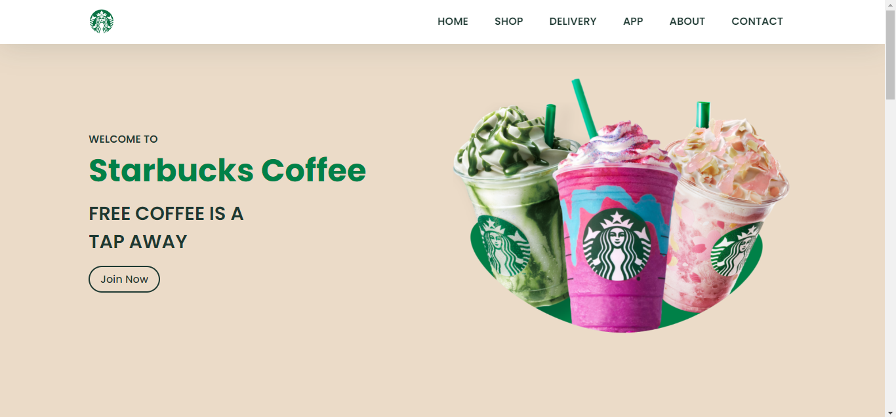

# Starbucks Website (Landing Page)

This is a simple static website (Landing Page) created for a fictional Starbucks coffee shop by Mohit Patil. The website features various sections such as Home, Shop, Delivery, App, About, and Contact. It also includes responsive design elements for better viewing experience on different devices.

## Preview



## Sections

1. Home: Introduces Starbucks and highlights its slogan.
2. Shop: Displays various coffee options with images, descriptions, and prices.
3. Delivery: Provides information on how to order Starbucks via Uber Eats.
4. App: Promotes the Starbucks mobile app for easier ordering.
5. About: Briefly describes Starbucks' history and mission.
6. Contact: Provides social media links and legal information.

## Technologies Used

- HTML
- CSS
- JavaScript

## Setup

Simply clone the repository and open the index.html file in your web browser.

## Credits

**[Mohit Patil](https://www.linkedin.com/in/mohittt-p)**: Frontend Developer

## License

This project is licensed under the MIT License - see the LICENSE file for details.

## Social Media

You can find me on social media:

- [Twitter](https://twitter.com/mohittt_p)
- [Instagram](https://www.instagram.com/mohittt_p)
- [LinkedIn](https://www.linkedin.com/in/mohittt-p)

## Setup

Simply clone the repository and open the index.html file in your web browser.

```bash
git clone https://github.com/mohiittt/starbucks-website.git
cd starbucks-website


```
